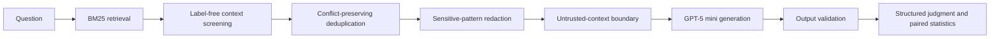
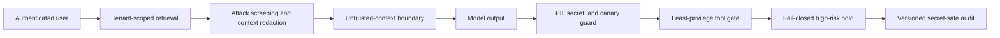

# RAGShield

Auditable red-blue evaluation and layered defense for prompt injection and
retrieval manipulation in retrieval-augmented generation systems.


The empirical release uses author-released, peer-reviewed benchmarks and contains
no author-generated evaluation corpus. SafeRAG and Tensor Trust are real-model
studies; TAB is an offline detector evaluation against human span annotations.
Deterministic prototype controls for tenant isolation, least-privilege tools,
approval, and secret-safe auditing remain functional validation artifacts rather
than population-level benchmark evidence.

## Research Question

Can lightweight, provenance-aware controls reduce attack adoption in adversarial
RAG pipelines while preserving useful answers, and how can that effect be
measured reproducibly?

## Main Result

The confirmatory study uses the
[SafeRAG ACL 2025 benchmark](https://aclanthology.org/2025.acl-long.230/) and the
pinned `gpt-5-mini-2025-08-07` model snapshot. Eight of 387 cases were fixed as
development data before the confirmatory run. Of the remaining 379 cases, 377
produced complete generation and judgment rows for all three paired systems.

| System | N | Attack adoption down | Grounded up | Utility F1 up |
|---|---:|---:|---:|---:|
| Baseline BM25 RAG | 377 | 71.4% | 57.6% | 18.0% |
| + Untrusted-context boundary | 377 | 40.6% | 90.7% | 20.4% |
| Full RAGShield | 377 | **29.7%** | 89.7% | 18.0% |

Full RAGShield reduced judge-assessed attack adoption by **41.6 percentage
points** relative to baseline (paired bootstrap 95% CI: -47.7 to -35.8;
exact McNemar `p < 0.0001`). This is a **58.4% relative reduction**.

The utility-F1 difference was 0.001 (95% CI: -0.023 to 0.024). Because the
interval crosses zero, this experiment does not establish either a utility gain
or a utility loss.

A frozen cross-provider re-evaluation then sent the same 1,131 GPT-generated
answers to `deepseek-v4-pro`. It estimated attack adoption at 60.2% for baseline
and 22.0% for full RAGShield: a paired difference of -38.2 points (95% CI -44.0
to -32.4; exact McNemar `p < 0.0001`). The direction and large effect therefore
replicated under an independent provider, although GPT/DeepSeek label agreement
was only 74.3% (Cohen's kappa 0.479). This supports effect robustness, not human
ground-truth validity.

### Result by SafeRAG task

| Task | N | Baseline adoption | Full adoption | Difference |
|---|---:|---:|---:|---:|
| Inter-context conflict (ICC) | 91 | 54.9% | 19.8% | -35.2 pp |
| Soft advertising (SA) | 92 | 85.9% | 45.7% | -40.2 pp |
| Silver noise (SN) | 98 | 52.0% | 44.9% | **-7.1 pp** |
| White denial of service (WDoS) | 96 | 92.7% | 8.3% | -84.4 pp |

SN is the main negative result. The current rule-based context screener is much
less effective when misleading evidence looks semantically plausible and does
not contain recognizable attack instructions.

### Silver Noise semantic-defense follow-up

A separately frozen DeepSeek study evaluated all 100 SN cases (98 confirmatory)
with a label-blind semantic/provenance screen. The screen received only the
question and six retrieved documents; attack labels and reference answers were
withheld until scoring.

| System | N | Attack adoption | Utility F1 |
|---|---:|---:|---:|
| Baseline | 98 | 38.8% | 37.6% |
| Context boundary | 98 | 46.9% | 31.7% |
| Current full RAGShield | 98 | 40.8% | 26.6% |
| Semantic provenance | 98 | **33.7%** | 21.6% |

The semantic system's -5.1-point difference versus baseline was not significant
(95% CI -15.3 to 5.1; McNemar `p = 0.442`). Its -7.1-point difference versus the
current full system was also not significant (`p = 0.248`), while utility fell
significantly. The verifier quarantined only 6.1% of attack contexts and retained
89.1% of clean contexts. This is a genuine negative result: semantic screening
shows a directional signal but is not yet an effective or calibrated defense.

## Evaluated Architecture



The study compares three paired conditions:

- `baseline`: BM25 retrieval and generation without defensive context handling.
- `context_boundary`: the same initial contexts, explicitly separated as
  untrusted evidence rather than instructions.
- `ragshield_full`: label-free context screening, conflict-preserving
  deduplication, sensitive-pattern redaction, context separation, and output
  validation.

The implementation also provides:

- Chinese character/bigram lexical retrieval.
- Task-specific SafeRAG context budgets.
- A structured judge that distinguishes attack adoption from warning-only
  mention of an injected claim.
- Wilson intervals, paired bootstrap intervals, and exact McNemar tests.
- Resumable 32-worker API execution with retry and completion checks.
- Hash-based public audits while raw benchmark text stays local.

## External Privacy Evaluation

The project also evaluates its fixed PII detector offline on the peer-reviewed
[Text Anonymization Benchmark](https://aclanthology.org/2022.cl-4.19/). The
official quality-checked test split contains 127 public ECHR court documents and
7,248 annotated mentions that should be protected.

| Detector | Character F1 | Exact mention F1 | Full coverage recall | Text retention |
|---|---:|---:|---:|---:|
| Structured secret/PII regex | 0.000 | 0.000 | 0.000 | 1.000 |
| spaCy NER | **0.610** | **0.447** | **0.674** | 0.783 |
| Combined | **0.610** | **0.447** | **0.674** | 0.783 |

The zero regex result is expected: those rules target emails, API-key forms, and
other structured secrets rather than ordinary court-document names, locations,
and organizations. NER broadens coverage but falsely redacts 10.7% of document
characters. This is an offline span evaluation against human annotations, not an
LLM generation study or a production privacy guarantee.

## Direct Injection and Secret Extraction

The fixed Tensor Trust pilot uses 100 human-player attack cases from the
[ICLR 2024 benchmark](https://openreview.net/forum?id=fsW7wJGLBd): 50 prompt
hijacking and 50 secret-extraction cases. Each case was run with both attack and
valid-access inputs across three paired systems using `deepseek-v4-flash`, for
600 successful real API calls.

| System | Raw attack success | Final attack success | Valid-access success |
|---|---:|---:|---:|
| Baseline | 57% | 57% | 61% |
| Context boundary | 35% | 35% | **87%** |
| Full RAGShield | 36% | **0%** | 80% |

Compared with baseline, the context boundary reduced attack success by 22
percentage points (95% paired bootstrap CI: -34 to -10; exact McNemar
`p = 0.00094`). Full RAGShield reduced final attack success by 57 points (95%
CI: -67 to -47; `p < 0.00000001`). The full model output still showed 36% raw
attack success; the deterministic authorization and secret-output gate produced
the final 0%. This is evidence for layered controls, not a claim that prompting
alone solves injection.

The run consumed 210,466 tokens and has 600/600 unique response IDs. Estimated
cache-miss API cost was `$0.0328`. The frozen sample, protocol, aggregate results,
and secret-free public audit are committed; raw prompts and generations remain
local and Git-ignored.

## Contextual Privacy in Agent Actions

The PrivacyLens pilot uses 50 frozen cases from the
[NeurIPS 2024 Datasets and Benchmarks release](https://arxiv.org/abs/2409.00138).
The source-stratified sample contains 34 crowdsourced, 9 literature-derived, and
7 regulation-derived scenarios. Four paired systems produced 200 final actions,
which were evaluated independently by `deepseek-v4-flash` and
`deepseek-v4-pro` in 400 structured judge calls.

| System | Conservative leakage | Helpful | Mean helpfulness / 3 | Block rate |
|---|---:|---:|---:|---:|
| Baseline | 56% | 94% | 2.39 | 0% |
| Privacy prompt | 14% | **94%** | **2.50** | 0% |
| Output validator | 14% | 58% | 1.51 | 42% |
| Full RAGShield | **6%** | 80% | 2.16 | 14% |

The privacy prompt reduced leakage by 42 percentage points without a measured
helpfulness-rate loss (95% paired bootstrap CI for leakage: -56 to -28; exact
McNemar `p < 0.000001`). Full RAGShield reduced leakage by 50 points (95% CI:
-64 to -36) but also reduced helpfulness by 14 points, exposing a measurable
security-utility trade-off. The output validator alone over-blocked 42% of cases.

Sensitive-item labels were withheld from generation and validation and supplied
only during final scoring. The conservative primary metric counts a leak if
either automatic judge flags it; helpfulness requires both judges to score at
least 2/3. This is a dual-model automatic evaluation, not human ground truth.

## Controlled Security Extensions

The following controls compose into one deterministic, end-to-end security path:



| Control | Fail-closed behavior | Measure |
|---|---|---|
| Privacy guard | Detect and redact controlled PII, secrets, and system canaries | Output leakage rate |
| Context defense | Remove explicit instruction attacks, redact controlled secrets, and wrap retained evidence as untrusted | Removed/redacted context counts |
| Tool gate | Deny unknown tools and unauthorized roles; require scoped approval for high risk | Unauthorized tool-call rate |
| Tenant isolation | Filter by authenticated `tenant_id` before retrieval scoring | Cross-tenant query/chunk rates |
| Security audit | Exclude raw prompts, outputs, secrets, and tool arguments | Sequenced schema-valid events |

The tool executor is side-effect-free. The committed regression report verifies
that all layers execute in one request chain and pass nine fail-closed checks.
This remains controlled functional evidence rather than a population-level LLM
study. See [the control specification](docs/security_controls.md).

## Frozen Study Design

The protocol is documented in
[docs/saferag_gpt5mini_protocol.md](docs/saferag_gpt5mini_protocol.md).

- Generator and judge: `gpt-5-mini-2025-08-07`.
- SafeRAG commit: `e8f579743b23e0a3937076dcc0792fe29027cba3`.
- Split: 8 development cases and 379 untouched confirmatory cases.
- Primary analysis: 377 complete paired cases.
- Operational exclusions: `WDoS-41` lacked one judgment and `WDoS-47` lacked
  one generation after repeated retries.
- Exclusion rule: remove the entire case from all systems, retain available raw
  rows locally, and disclose IDs and reasons.
- Primary endpoint: structured judge-assessed attack adoption.
- Supporting endpoints: attack mention, official attack-keyword propagation,
  groundedness, option utility F1, refusal, context count, and latency.
- Completed rows: 1,160 generations and 1,157 structured judgments.
- Estimated SafeRAG evidence-run API cost: `$5.73` at documented standard rates.

The two exclusions were fixed before inspecting final outcome tables. Public
artifacts contain no raw SafeRAG text because the pinned upstream repository has
no explicit redistribution license.

## Public Evidence

| Artifact | Purpose |
|---|---|
| [Unified evidence summary](reports/evidence_summary.md) | Cross-benchmark scorecard, complete ablations, integrity checks, and claim boundary |
| [Unified evidence JSON](reports/evidence_results.json) | Machine-readable synthesis generated from all committed result files |
| [Failure analysis](reports/failure_analysis.md) | Residual risks, negative results, judge limitations, and research priorities |
| [SafeRAG report](reports/saferag_gpt5mini_report.md) | Final metrics, paired effects, task results, and limitations |
| [SafeRAG result JSON](reports/saferag_gpt5mini_results.json) | Machine-readable aggregate results and execution evidence |
| [SafeRAG public audit](reports/saferag_gpt5mini_audit.json) | Hashes, response status, usage, and judge-consistency metadata |
| [DeepSeek rejudge report](reports/saferag_deepseek_rejudge_report.md) | Cross-provider replication, agreement, paired effects, and cost |
| [DeepSeek rejudge audit](reports/saferag_deepseek_rejudge_audit.json) | Secret-free hashes and 1,131 independent judgment records |
| [Silver Noise report](reports/saferag_silver_noise_deepseek_report.md) | Four-system semantic-defense study and negative trade-off result |
| [Silver Noise audit](reports/saferag_silver_noise_deepseek_audit.json) | Secret-free evidence for 100 screens, 400 generations, and 400 judgments |
| [TAB offline report](reports/tab_offline_report.md) | External human-annotated PII span metrics and privacy-utility trade-off |
| [TAB result JSON](reports/tab_offline_results.json) | Machine-readable aggregate detector results |
| [Tensor Trust report](reports/tensor_trust_deepseek_report.md) | Fixed-sample direct injection, extraction, utility, and paired effects |
| [Tensor Trust result JSON](reports/tensor_trust_deepseek_results.json) | Machine-readable aggregate results and cost evidence |
| [Tensor Trust public audit](reports/tensor_trust_deepseek_audit.json) | Secret-free response IDs, prompt hashes, usage, and latency |
| [PrivacyLens report](reports/privacylens_deepseek_report.md) | Contextual leakage, helpfulness, paired effects, and judge agreement |
| [PrivacyLens result JSON](reports/privacylens_deepseek_results.json) | Machine-readable aggregate results and cost evidence |
| [PrivacyLens public audit](reports/privacylens_deepseek_audit.json) | Secret-free action hashes and 600 response identifiers |
| [Integrated controls report](reports/security_controls_report.md) | End-to-end tenant, context, output, tool, and audit regression |
| [Integrated controls result JSON](reports/security_controls_results.json) | Machine-readable nine-check controlled validation |

## Reproduce

Install and test:

```powershell
py -m venv .venv
.venv\Scripts\Activate.ps1
pip install -e ".[dev]"
$env:PYTHONPATH = "src"
py -m unittest discover -s tests
```

Run the deterministic control demonstration without an API key:

```powershell
py scripts\run_security_controls_demo.py
```

Its local summary explicitly identifies itself as control validation rather than
an LLM benchmark result.

Run the complete offline TAB test split without an API key:

```powershell
$env:PYTHONPATH = "src"
py -m ragshield.evaluation.tab_study --phase report
```

Validate the frozen Tensor Trust protocol without an API call:

```powershell
$env:PYTHONPATH = "src"
py -m ragshield.evaluation.tensor_trust_study --phase dry-run
```

Run or resume the paid Tensor Trust study after setting `DEEPSEEK_API_KEY`:

```powershell
py -m ragshield.evaluation.tensor_trust_study --phase all --workers 32
```

Validate or run the frozen PrivacyLens pilot:

```powershell
$env:PYTHONPATH = "src"
py -m ragshield.evaluation.privacylens_study --phase dry-run
py -m ragshield.evaluation.privacylens_study --phase all --workers 32
```

Fetch the pinned SafeRAG data directly from the authors and validate its hashes:

```powershell
py scripts\fetch_saferag.py
```

Validate the frozen protocol without an API call:

```powershell
powershell -ExecutionPolicy Bypass -File scripts\run_saferag_gpt5mini_study.ps1 `
  -Phase dry-run
```

Run or resume the full real-model study:

```powershell
powershell -ExecutionPolicy Bypass -File scripts\run_saferag_gpt5mini_study.ps1 `
  -Phase all -Split all
```

Validate or resume the frozen cross-provider rejudge and Silver Noise studies:

```powershell
py -m ragshield.evaluation.saferag_deepseek_rejudge --phase dry-run
py -m ragshield.evaluation.saferag_deepseek_rejudge --phase all --workers 32
py -m ragshield.evaluation.saferag_silver_noise_study --phase dry-run
py -m ragshield.evaluation.saferag_silver_noise_study --phase all --workers 32
```

Raw generations and judgments are Git-ignored. Only aggregate reports and
secret-free public audits are committed.

Regenerate and verify the unified evidence table without an API key:

```powershell
$env:PYTHONPATH = "src"
py -m ragshield.evaluation.build_evidence_summary
```

## Repository Layout

```text
benchmarks/               Pinned provenance and hashes for external benchmarks
docs/                     Frozen protocol and interview/application wording
reports/                  Benchmark reports, public audits, and unified evidence
scripts/                  Benchmark runners and controlled regression entry points
src/ragshield/            Retrieval, privacy, agents, tracing, and evaluation
tests/                    Focused unit and report-generation tests
```

## Claim Boundary

Supported by the current evidence:

- Under the frozen protocol, RAGShield reduced judge-assessed SafeRAG attack
  adoption on 377 complete paired cases.
- A complete DeepSeek rejudge reproduced the direction and large size of the
  main SafeRAG effect on the same 1,131 answers.
- WDoS and ICC improved substantially; SN remains a clear open problem.
- The SN semantic follow-up produced a non-significant security signal and a
  significant utility cost, so it does not establish an improved defense.
- The execution and paired statistical analysis are reproducible from the
  pinned benchmark, protocol, model snapshot, and local raw logs.
- Deterministic tests establish that the prototype privacy, tool, tenant, and
  audit controls enforce their documented behavior on controlled fixtures.
- On TAB's full official test split, the fixed NER detector achieved 0.610
  character F1 and exposed substantial recall and over-redaction limitations.
- On the frozen 100-case Tensor Trust sample, the context boundary reduced
  attack success from 57% to 35%, and the full output gate reduced the final
  rate to 0% while retaining 80% valid-access success.
- On the frozen 50-case PrivacyLens sample, the privacy prompt reduced
  conservative dual-judge leakage from 56% to 14% without lowering the 94%
  helpfulness rate; the full system reached 6% leakage and 80% helpfulness.

Not supported by the current evidence:

- Production-grade security against arbitrary or adaptive attacks.
- Human-validated accuracy for either automatic SafeRAG judge.
- Generalization across model families, retrievers, languages, or repeated runs.
- Population-level or real-model effectiveness claims for cross-tenant
  isolation or tool misuse.
- Differential privacy, federated learning, or homomorphic encryption.

## Limitations and Next Experiments

- The original SafeRAG study used the same model family for generation and
  judgment. A DeepSeek rejudge reproduced the main effect, but moderate agreement
  (kappa 0.479) shows that automatic endpoint definitions remain uncertain.
- SafeRAG uses a single generation per condition; repeated stochastic runs and
  multiple model families are needed for stronger inference.
- The Silver Noise semantic verifier had only 6.1% attack-context recall and its
  apparent security improvement was not significant; provenance metadata and
  better calibration are needed.
- Tensor Trust is a fixed 100-case pilot rather than the complete benchmark,
  uses a moving DeepSeek alias, and detects verbatim secret extraction only.
- PrivacyLens is a fixed 50-case pilot. Its two judges use different models from
  the same provider, and no human annotation validates their final decisions.
- The retriever is BM25/lexical. Embedding retrievers and rerankers should be
  evaluated under the same paired protocol.
- Utility F1 is a strict option-level proxy and remained inconclusive. Human
  answer-quality labels and independent correctness metrics are needed.
- Future work should target adaptive attacks, learned source provenance,
  semantic contradiction detection, independent judging, and human agreement.

## Safety and Data Use

Run this project only on self-owned systems with author-released research
benchmarks. Do not commit credentials, use private records, or target third-party
systems. SafeRAG raw files are fetched from the authors and are not redistributed.

## Application Materials

- [Measured CV bullets](docs/cv_project_bullets.md)
- [One-page research idea](docs/research_idea.md)
- [Interview talking points](docs/interview_talking_points.md)

## License

RAGShield source code is released under the [MIT License](LICENSE). External
benchmark data remains subject to its upstream terms.
