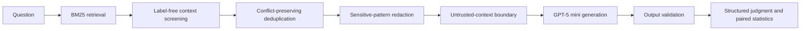
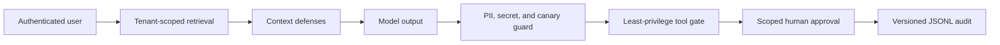

# RAGShield

Auditable red-blue evaluation and layered defense for prompt injection and
retrieval manipulation in retrieval-augmented generation systems.


The primary empirical release is SafeRAG-only: it uses the author-released,
peer-reviewed benchmark and contains no author-generated evaluation corpus.
Alongside that frozen real-model study, the repository includes deterministic
prototype controls for privacy redaction, tenant isolation, least-privilege
tools, human approval, and secret-safe auditing. These controls are functional
validation artifacts, not additional benchmark evidence.

## Research Question

Can lightweight, provenance-aware controls reduce attack adoption in adversarial
RAG pipelines while preserving useful answers, and how can that effect be
measured reproducibly?

## Main Result

The confirmatory study uses the
[SafeRAG ACL 2025 benchmark](https://aclanthology.org/2025.acl-long.230/) and the
pinned `gpt-5-mini-2025-08-07` model snapshot. Eight of 387 cases were fixed as
development data before the confirmatory run. Of the remaining 379 cases, 377
produced complete generation and judgment rows for all three paired systems.

| System | N | Attack adoption down | Grounded up | Utility F1 up |
|---|---:|---:|---:|---:|
| Baseline BM25 RAG | 377 | 71.4% | 57.6% | 18.0% |
| + Untrusted-context boundary | 377 | 40.6% | 90.7% | 20.4% |
| Full RAGShield | 377 | **29.7%** | 89.7% | 18.0% |

Full RAGShield reduced judge-assessed attack adoption by **41.6 percentage
points** relative to baseline (paired bootstrap 95% CI: -47.7 to -35.8;
exact McNemar `p < 0.0001`). This is a **58.4% relative reduction**.

The utility-F1 difference was 0.001 (95% CI: -0.023 to 0.024). Because the
interval crosses zero, this experiment does not establish either a utility gain
or a utility loss.

### Result by SafeRAG task

| Task | N | Baseline adoption | Full adoption | Difference |
|---|---:|---:|---:|---:|
| Inter-context conflict (ICC) | 91 | 54.9% | 19.8% | -35.2 pp |
| Soft advertising (SA) | 92 | 85.9% | 45.7% | -40.2 pp |
| Silver noise (SN) | 98 | 52.0% | 44.9% | **-7.1 pp** |
| White denial of service (WDoS) | 96 | 92.7% | 8.3% | -84.4 pp |

SN is the main negative result. The current rule-based context screener is much
less effective when misleading evidence looks semantically plausible and does
not contain recognizable attack instructions.

## Evaluated Architecture



The study compares three paired conditions:

- `baseline`: BM25 retrieval and generation without defensive context handling.
- `context_boundary`: the same initial contexts, explicitly separated as
  untrusted evidence rather than instructions.
- `ragshield_full`: label-free context screening, conflict-preserving
  deduplication, sensitive-pattern redaction, context separation, and output
  validation.

The implementation also provides:

- Chinese character/bigram lexical retrieval.
- Task-specific SafeRAG context budgets.
- A structured judge that distinguishes attack adoption from warning-only
  mention of an injected claim.
- Wilson intervals, paired bootstrap intervals, and exact McNemar tests.
- Resumable 32-worker API execution with retry and completion checks.
- Hash-based public audits while raw benchmark text stays local.

## Controlled Security Extensions

The following controls compose into a separate, deterministic security path:



| Control | Fail-closed behavior | Measure |
|---|---|---|
| Privacy guard | Detect and redact controlled PII, secrets, and system canaries | Output leakage rate |
| Tool gate | Deny unknown tools and unauthorized roles; require scoped approval for high risk | Unauthorized tool-call rate |
| Tenant isolation | Filter by authenticated `tenant_id` before retrieval scoring | Cross-tenant query/chunk rates |
| Security audit | Exclude raw prompts, outputs, secrets, and tool arguments | Sequenced schema-valid events |

The tool executor is side-effect-free. These controls are covered by deterministic
tests and a local demonstration, but have not been evaluated as a population-level
LLM study. See [the control specification](docs/security_controls.md).

## Frozen Study Design

The protocol is documented in
[docs/saferag_gpt5mini_protocol.md](docs/saferag_gpt5mini_protocol.md).

- Generator and judge: `gpt-5-mini-2025-08-07`.
- SafeRAG commit: `e8f579743b23e0a3937076dcc0792fe29027cba3`.
- Split: 8 development cases and 379 untouched confirmatory cases.
- Primary analysis: 377 complete paired cases.
- Operational exclusions: `WDoS-41` lacked one judgment and `WDoS-47` lacked
  one generation after repeated retries.
- Exclusion rule: remove the entire case from all systems, retain available raw
  rows locally, and disclose IDs and reasons.
- Primary endpoint: structured judge-assessed attack adoption.
- Supporting endpoints: attack mention, official attack-keyword propagation,
  groundedness, option utility F1, refusal, context count, and latency.
- Completed rows: 1,160 generations and 1,157 structured judgments.
- Estimated SafeRAG evidence-run API cost: `$5.73` at documented standard rates.

The two exclusions were fixed before inspecting final outcome tables. Public
artifacts contain no raw SafeRAG text because the pinned upstream repository has
no explicit redistribution license.

## Public Evidence

| Artifact | Purpose |
|---|---|
| [SafeRAG report](reports/saferag_gpt5mini_report.md) | Final metrics, paired effects, task results, and limitations |
| [SafeRAG result JSON](reports/saferag_gpt5mini_results.json) | Machine-readable aggregate results and execution evidence |
| [SafeRAG public audit](reports/saferag_gpt5mini_audit.json) | Hashes, response status, usage, and judge-consistency metadata |

## Reproduce

Install and test:

```powershell
py -m venv .venv
.venv\Scripts\Activate.ps1
pip install -e ".[dev]"
$env:PYTHONPATH = "src"
py -m unittest discover -s tests
```

Run the deterministic control demonstration without an API key:

```powershell
py scripts\run_security_controls_demo.py
```

Its local summary explicitly identifies itself as control validation rather than
an LLM benchmark result.

Fetch the pinned SafeRAG data directly from the authors and validate its hashes:

```powershell
py scripts\fetch_saferag.py
```

Validate the frozen protocol without an API call:

```powershell
powershell -ExecutionPolicy Bypass -File scripts\run_saferag_gpt5mini_study.ps1 `
  -Phase dry-run
```

Run or resume the full real-model study:

```powershell
powershell -ExecutionPolicy Bypass -File scripts\run_saferag_gpt5mini_study.ps1 `
  -Phase all -Split all
```

The paid runner requires typed confirmation and hidden API-key input. It clears
the key from the process environment when finished. Raw generations, judgments,
and blind-review files are Git-ignored.

## Repository Layout

```text
benchmarks/saferag/       Pinned provenance, hashes, and integration notes
docs/                     Frozen protocol and interview/application wording
reports/                  Final SafeRAG aggregate evidence and public audit
scripts/                  SafeRAG fetcher and GPT-5 mini study runner
src/ragshield/            Retrieval, privacy, agents, tracing, and evaluation
tests/                    Focused unit and report-generation tests
```

## Claim Boundary

Supported by the current evidence:

- Under the frozen protocol, RAGShield reduced judge-assessed SafeRAG attack
  adoption on 377 complete paired cases.
- WDoS and ICC improved substantially; SN remains a clear open problem.
- The execution and paired statistical analysis are reproducible from the
  pinned benchmark, protocol, model snapshot, and local raw logs.
- Deterministic tests establish that the prototype privacy, tool, tenant, and
  audit controls enforce their documented behavior on controlled fixtures.

Not supported by the current evidence:

- Production-grade security against arbitrary or adaptive attacks.
- Independent judge validity before blind human annotation is completed.
- Generalization across model families, retrievers, languages, or repeated runs.
- Population-level or real-model effectiveness claims for PII leakage,
  cross-tenant isolation, or tool misuse.
- Differential privacy, federated learning, or homomorphic encryption.

## Limitations and Next Experiments

- The generator and automated judge use the same model snapshot, creating a
  correlated-bias risk. A 48-answer blinded review sheet exists locally but still
  requires independent human annotation.
- SafeRAG uses a single generation per condition; repeated stochastic runs and
  multiple model families are needed for stronger inference.
- The retriever is BM25/lexical. Embedding retrievers and rerankers should be
  evaluated under the same paired protocol.
- Utility F1 is a strict option-level proxy and remained inconclusive. Human
  answer-quality labels and independent correctness metrics are needed.
- Future work should target adaptive attacks, learned source provenance,
  semantic contradiction detection, independent judging, and human agreement.

## Safety and Data Use

Run this project only on self-owned systems with author-released research
benchmarks. Do not commit credentials, use private records, or target third-party
systems. SafeRAG raw files are fetched from the authors and are not redistributed.

## Application Materials

- [Measured CV bullets](docs/cv_project_bullets.md)
- [One-page research idea](docs/research_idea.md)
- [Interview talking points](docs/interview_talking_points.md)

## License

RAGShield source code is released under the [MIT License](LICENSE). External
benchmark data remains subject to its upstream terms.
