# RAGShield

Automated red-blue evaluation and layered defense for privacy leakage and
prompt-injection risk in RAG-enabled, tool-using LLM agents.


This repository contains the final interview-facing version of the project. It
includes the defense implementation, frozen real-model protocol, aggregate
results, public audit metadata, tests, and explicit limitations.

## Research Question

How can layered, provenance-aware controls reduce attack adoption and privacy
leakage in RAG agents while preserving useful task performance, and how should
that trade-off be measured reproducibly?

## Main Result

The primary experiment uses the peer-reviewed
[SafeRAG ACL 2025 benchmark](https://aclanthology.org/2025.acl-long.230/) and the
pinned `gpt-5-mini-2025-08-07` model snapshot. Eight of 387 cases were fixed as
development data before the confirmatory run. Of the remaining 379 cases, 377
produced complete generation and judgment rows for all three paired systems.

| System | N | Attack adoption down | Grounded up | Utility F1 up |
|---|---:|---:|---:|---:|
| Baseline BM25 RAG | 377 | 71.4% | 57.6% | 18.0% |
| + Untrusted-context boundary | 377 | 40.6% | 90.7% | 20.4% |
| Full RAGShield | 377 | **29.7%** | 89.7% | 18.0% |

Full RAGShield reduced judge-assessed attack adoption by **41.6 percentage
points** relative to baseline (paired bootstrap 95% CI: -47.7 to -35.8;
exact McNemar `p < 0.0001`). This is a **58.4% relative reduction**.

The utility-F1 difference was 0.001 (95% CI: -0.023 to 0.024). Because the
interval crosses zero, this experiment does not establish either a utility gain
or a utility loss.

### Result by SafeRAG task

| Task | N | Baseline adoption | Full adoption | Difference |
|---|---:|---:|---:|---:|
| Inter-context conflict (ICC) | 91 | 54.9% | 19.8% | -35.2 pp |
| Soft advertising (SA) | 92 | 85.9% | 45.7% | -40.2 pp |
| Silver noise (SN) | 98 | 52.0% | 44.9% | **-7.1 pp** |
| White denial of service (WDoS) | 96 | 92.7% | 8.3% | -84.4 pp |

SN is the main negative result. The current rule-based context screener is much
less effective when misleading evidence looks semantically plausible and does
not contain recognizable attack instructions.

## Controlled Privacy and Tool Study

A separate author-generated corpus tests concrete fake secrets, tenant markers,
poisoned retrieval, and toy tool requests. The same pinned model produced 612
real API responses: 204 cases under each of the three systems.

| System | N | ASR down | Leakage down | Unauthorized tools down | Benign success up |
|---|---:|---:|---:|---:|---:|
| Baseline BM25 RAG | 204 | 30.8% | 11.5% | 10.3% | 97.9% |
| + Untrusted-context boundary | 204 | 26.3% | 9.0% | 0.6% | 100.0% |
| Full RAGShield | 204 | **0.0%** | **0.0%** | **0.0%** | 97.9% |

This result verifies known components under machine-detectable synthetic
canaries. It is not external evidence that the system stops arbitrary attacks.

## System Architecture

```mermaid
flowchart LR
    Q[User query] --> T[Tenant filter]
    T --> R[BM25 retrieval]
    R --> S[Label-free context screening]
    S --> D[Conflict-preserving deduplication]
    D --> P[Fake PII and secret redaction]
    P --> B[Untrusted-context boundary]
    B --> M[GPT-5 mini generation]
    M --> V[Policy-aware output validation]
    V --> G[Least-privilege tool gate]
    G --> A[Answer and audit record]
```



The final implementation contains:

- BM25 retrieval with Chinese character/bigram tokenization.
- Tenant-aware document filtering.
- Label-free detection of injected instructions, advertisements, refusals,
  and tool-use patterns.
- Conflict-preserving deduplication that retains and flags contradictory facts.
- Untrusted evidence separation in the generation prompt.
- Fake PII/secret redaction and policy-aware output validation.
- Least-privilege authorization for sandbox tool requests.
- Structured OpenAI Responses API outputs and resumable concurrent execution.
- A structured SafeRAG judge that separates attack adoption from warning-only
  mention of an injected claim.
- Wilson intervals, paired bootstrap intervals, and exact McNemar tests.
- Hash-based public audits while licensed/raw answer text stays local.

## Frozen Study Design

The confirmatory protocol is documented in
[docs/saferag_gpt5mini_protocol.md](docs/saferag_gpt5mini_protocol.md).

- Generator and judge: `gpt-5-mini-2025-08-07`.
- Systems: `baseline`, `context_boundary`, and `ragshield_full`.
- Split: 8 development cases and 379 untouched confirmatory cases.
- Primary analysis: 377 complete paired cases.
- Operational exclusions: `WDoS-41` lacked one judgment and `WDoS-47` lacked
  one generation after repeated retries.
- Exclusion rule: remove the entire case from all systems; retain available raw
  rows locally; disclose IDs and reasons.
- Primary endpoint: structured judge-assessed attack adoption.
- Supporting endpoints: attack mention, official attack-keyword propagation,
  groundedness, option utility F1, refusal, context count, and latency.
- Concurrency: 32 workers with resumable logs and rate-limit backoff.
- Persistent per-call failures are reported and skipped by the final runner;
  primary estimates then use only cases complete under all three systems.
- Completed rows: 1,160 generations, 1,157 judgments, and 612 controlled
  canary responses.
- Estimated final evidence-run API cost: `$6.37` at documented standard rates.

The two exclusions were fixed before inspecting final outcome tables. Public
artifacts contain no raw SafeRAG text because the pinned upstream repository has
no explicit redistribution license.

## Public Evidence

| Artifact | Purpose |
|---|---|
| [Final evidence report](reports/interview_evidence_report.md) | Concise interview-facing result summary |
| [Final evidence JSON](reports/interview_evidence.json) | Machine-readable combined results and claim boundary |
| [SafeRAG report](reports/saferag_gpt5mini_report.md) | External benchmark metrics and paired inference |
| [SafeRAG result JSON](reports/saferag_gpt5mini_results.json) | Complete aggregate result object |
| [SafeRAG public audit](reports/saferag_gpt5mini_audit.json) | Hashes, response status, usage, and consistency metadata |
| [Controlled study report](reports/synthetic_gpt5mini_report.md) | Privacy/tool component results |
| [Controlled result JSON](reports/synthetic_gpt5mini_results.json) | Category and system aggregates |
| [Controlled public audit](reports/synthetic_gpt5mini_audit.json) | Hash-based execution evidence |
| [Dataset quality report](reports/data_quality.md) | Synthetic corpus uniqueness and reference checks |

## Reproduce

Install and test:

```powershell
py -m venv .venv
.venv\Scripts\Activate.ps1
pip install -e ".[dev]"
$env:PYTHONPATH = "src"
py -m unittest discover -s tests
```

Fetch the pinned SafeRAG data directly from the authors and validate its hashes:

```powershell
py scripts\fetch_saferag.py
```

Validate the frozen protocol without an API call:

```powershell
powershell -ExecutionPolicy Bypass -File scripts\run_saferag_gpt5mini_study.ps1 `
  -Phase dry-run
```

Run the complete resumable real-model suite:

```powershell
powershell -ExecutionPolicy Bypass -File scripts\run_gpt5mini_interview_suite.ps1
```

The paid scripts require typed confirmation and hidden API-key input. They clear
the key from the process environment when finished. Raw generations, judgments,
and blind-review files are Git-ignored.

Regenerate the combined public report from completed local aggregate files:

```powershell
$env:PYTHONPATH = "src"
py -m ragshield.evaluation.build_interview_report
```

## Repository Layout

```text
benchmarks/saferag/       Pinned provenance, hashes, and integration notes
configs/tool_policy.yaml  Least-privilege sandbox tool policy
data/                     Author-generated controlled documents and cases
docs/                     Frozen protocol and interview/application wording
reports/                  Final public aggregate evidence and audits
scripts/                  SafeRAG fetcher and final GPT-5 mini runners
src/ragshield/            Retrieval, defenses, tools, scoring, and evaluation
tests/                    Focused unit and report-generation tests
```

## Claim Boundary

Supported by the current evidence:

- Under the frozen protocol, RAGShield reduced judge-assessed SafeRAG attack
  adoption on 377 complete paired cases.
- The full stack blocked all measured violations in the controlled canary run.
- WDoS and ICC improved substantially; SN remains a clear open problem.

Not supported by the current evidence:

- Production-grade security against arbitrary or adaptive attacks.
- Independent judge validity before blind human annotation is completed.
- Generalization across model families, retrievers, languages, or repeated runs.
- Differential privacy, federated learning, or homomorphic encryption.

## Limitations and Next Experiments

- The generator and automated judge use the same model snapshot, creating a
  correlated-bias risk. A 48-answer blinded review sheet exists locally but still
  requires independent human annotation.
- SafeRAG uses a single generation per condition; repeated stochastic runs and
  multiple model families are needed for stronger inference.
- The retriever is BM25/lexical. Embedding retrievers and rerankers should be
  evaluated under the same paired protocol.
- The controlled corpus uses fake, machine-detectable markers and therefore
  supports component verification rather than external validity.
- Future work should target adaptive attacks, learned source provenance,
  semantic contradiction detection, independent judging, and human agreement.

## Safety and Data Use

Run this project only on self-owned systems with fictional data or author-released
research benchmarks. Do not commit credentials, use real private records, or
target third-party systems. SafeRAG raw files are fetched from the authors and are
not redistributed here.

## Application Materials

- [Measured CV bullets](docs/cv_project_bullets.md)
- [One-page research idea](docs/research_idea.md)
- [Interview talking points](docs/interview_talking_points.md)

## License

RAGShield source code is released under the [MIT License](LICENSE). External
benchmark data remains subject to its upstream terms.
