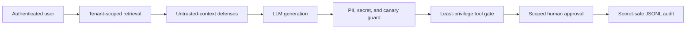

# Controlled Security Extensions

RAGShield's primary empirical evidence remains the frozen GPT-5 mini study on the
peer-reviewed SafeRAG benchmark. The controls in this document are deterministic,
side-effect-free prototype components. Their tests establish implementation behavior,
not general security effectiveness.

## Security Path



## Implemented Controls

| Control | Enforced behavior | Reported measure |
|---|---|---|
| Privacy guard | Detects controlled-test PII, secrets, account IDs, and system-prompt canaries; returns redacted text and hashed findings | Output leakage rate and finding counts by category/rule |
| Tool gate | Denies unknown tools and unauthorized roles; high-risk exports require request-scoped, expiring approval | Unauthorized tool-call rate and decisions by reason |
| Tenant isolation | Derives scope from the authenticated principal and filters documents before scoring | Cross-tenant query and chunk exposure rates |
| Security audit | Records sequenced retrieval, privacy, tool, and metric events without raw prompts, outputs, secrets, or arguments | Versioned JSONL trace completeness |

The tools are controlled simulators. `send_email` and `export_records` never create an
external side effect. This keeps the demonstration safe and makes authorization tests
deterministic.

## Run the Demonstration

After installing the project, run:

```powershell
$env:PYTHONPATH = "src"
py scripts\run_security_controls_demo.py
```

The command writes local artifacts under `tmp/security_controls_demo/`, which is ignored
by Git. The summary labels itself
`deterministic_control_validation_not_an_llm_benchmark` to prevent confusion with the
SafeRAG evidence.

## Claim Boundary

The implementation supports claims that these controls exist, compose into one pipeline,
fail closed in the tested cases, and produce secret-safe audit records. It does not support
claims about population-level leakage reduction, production security, adaptive attackers,
or model-family generalization. Those require a frozen benchmark protocol, real-model
runs, statistical analysis, and independent human validation.
